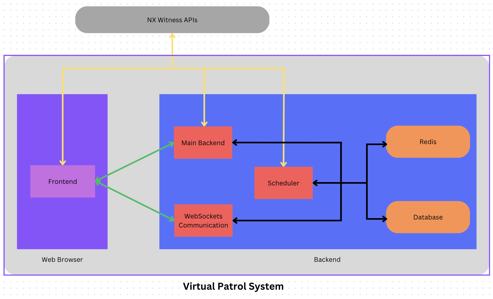

# Virtual Patrol System

## Description

This is the overall application architecture to run as a web application.



## Project structure

- _packages_:
  - __main-backend__ : backend package containing CRUD apis
  - __scheduler__: backend package containing cron job scheduler
  - __frontend__: frontend package
- _swagger_: documentation application of __main-backend__ apis
- _test_ : unit/integration test for __main-backend__ apis

## Prerequisites

The following libraries/frameworks need to be installed on your system:

1. NodeJS (>= 20)
2. Yarn (>= 1.7.0)
3. Docker
4. Lerna (>= 7.0.0)

## Getting Started

To get started, here are the steps you need to do on your local machine in case of development env.

1. Start PostgreSQL database server 
2. Build an empty postgres database named `vps_dev`. 
3. Start Redis server

### Install necessary dependencies in development environment

To prepare development environment when you first clone this project, please run

```bash
yarn bootstrap
```

### Run application in development environment

To run application in development environment, please run:

```bash
lerna run dev
```

### Build and run application in production

To build production application, please run:

```bash
yarn build
```

To start the entire application with all three services ( main-backend, scheduler, frontend) after `yarn build` , please run:

```bash
lerna run start
```

### Test

Before testing, you need to run your application first by using the already mentioned steps and commands

To test backend api with jest, please run:

```bash
yarn run test
```

To test frontend UI with cypress, please run:

```bash
yarn workspace @vps/frontend test:e2e-cmd // on console
``````
or

```bash
yarn workspace @vps/frontend test:e2e // on GUI
```


### Single Package Management

Sometimes, you might need to manage single package manually for debugging purpose. Here are the ones

To run frontend for develop environment

```bash
yarn workspace @vps/frontend dev
```

To run main-backend for develop environment

```bash
yarn workspace @vps/main-backend dev
```

To run scheduler for develop environment

```bash
yarn workspace @vps/scheduler dev
```

### Environment Variables

To manage env variables including login username and password, please check `.env` files
